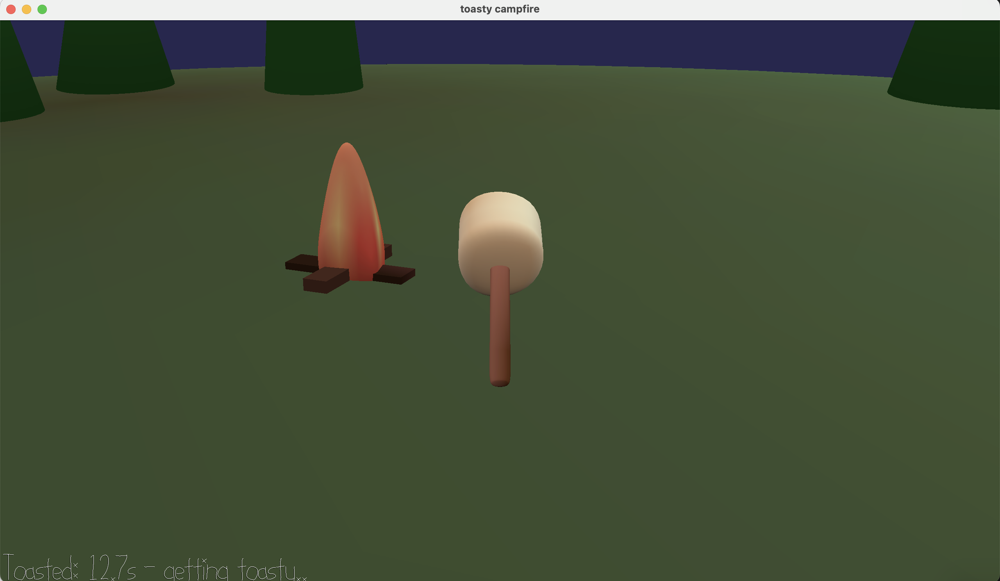

# Toasty campfire

Author: Fara Yan

Design: Gather around the campfire and roast marshmallows! Move your skewer close to the fire to toast it.

### How To Play:

Controls:
* A / D – Rotate left and right
* W / S – Move forward and backward in the direction you’re facing
* Press Space to restart the game

Play:
Fires will randomly appear around the campfire for a few seconds. You have a marshmallow and each marshmallow has its own amount of time needed to toast to perfection (between 7–15 seconds). Hold your marshmallow over the fire to toast it. Try to reach a perfect golden texture! If you go over this toasty limit, you might burn your marshmallow :(, so beware!

This game was built with [NEST](NEST.md).
